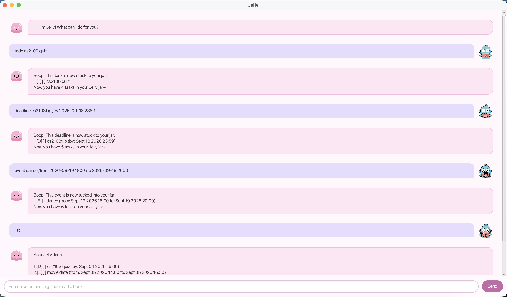

# Jelly User Guide

Jelly is a lightweight task manager with support for to-do tasks, deadlines,
events, searching, and tags. Jelly saves your tasks for you so that you can
return to them whenever~



## Quick Start

1. Open Jelly and add a few tasks:

   ```text
   todo read chapter 3
   deadline submit report /by 2026-09-30 1800
   event team meeting /from 2026-09-20 1400 /to 2026-09-20 1500
   ```

2. Use `list` to view all your tasks:

   ```text
   list
   ```

## Features

### Add a to-do task: `todo`

Use `todo <description>` for a task without a specific date or time.

```text
todo read chapter 3
```

### Add a deadline: `deadline`

Use `deadline <description> /by <date time>` for a task that must be completed
by a particular date and time.

```text
deadline submit report /by 2026-09-30 1800
```

The date and time format is `yyyy-MM-dd HHmm`.

### Add an event: `event`

Use `event <description> /from <start time> /to <end time>` for a task that
takes place over a period of time.

```text
event team meeting /from 2026-09-20 1400 /to 2026-09-20 1500
```

Use the date and time format `yyyy-MM-dd HHmm`. An event's end time must be
later than its start time. Jelly confirms each new task and saves it to the
local data file.

### View tasks: `list`

Use `list` to display every task. Each task is shown with a number that can be
used by other commands.

### Find tasks: `find`

Use `find <keyword>` to search task descriptions. Searches are case-insensitive
and can match part of a description.

```text
find report
```

### Mark task as complete: `mark`

Use `mark <task_number>` to mark a task as done.

```text
mark 1
```

### Mark task as incomplete: `unmark`

Use `unmark <task_number>` to mark a completed task as incomplete.

```text
unmark 1
```

### Delete tasks: `delete`

Use `delete <task_number>` to permanently remove a task.

```text
delete 1
```

### Organise tasks with tags: `tag` and `untag`

Use `tag <number> <tag>` to assign a tag, for example `tag 1 school`.
Tags may contain letters, numbers, hyphens, or underscores. Remove a tag with
`untag <number>`.

```text
tag 1 school
untag 1
```

### Exit Jelly: `bye`

Use `bye` to exit Jelly.

### View available commands: `help`

Use `help` to display every available command and its required format.

### Revisit past commands

Use the up and down arrow keys to revisit commands from your command history.

## Command summary

| Command | Purpose |
| --- | --- |
| `todo <description>` | Add a to-do task |
| `deadline <description> /by <date time>` | Add a deadline |
| `event <description> /from <date time> /to <date time>` | Add an event |
| `list` | Show all tasks |
| `find <keyword>` | Search task descriptions |
| `mark <number>` | Mark a task as done |
| `unmark <number>` | Mark a task as not done |
| `tag <number> <tag>` | Add or replace a task tag |
| `untag <number>` | Remove a task tag |
| `delete <number>` | Delete a task |
| `help` | Show available commands and formats |
| `bye` | Exit Jelly |

## Tips

- Enter commands with single spaces between parts.
- Use the task number from the latest `list` output; deleting a task changes
  the numbers below it.
- Jelly saves changes automatically and reloads them the next time it starts.
- If a command is invalid, Jelly explains the expected format and keeps your
  existing tasks unchanged.
